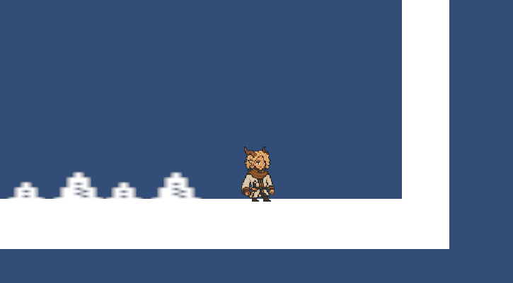
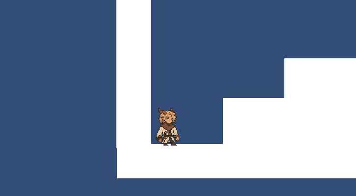

<h1 align="center">Soulbound Demo Development</h1>

## Table of Contents

- [Showcase](#Showcase)
- [Description](#Desciption)
  - [Story and Objective](#Story-and-Objective)
  - [Movement System](#Movement-System)
- [User Documentation](#User-Documentation)
- [User Control Guide](#user-control-guide)
- [Script Editing Software](#script-editing-software)
- [Asset Showcase](#asset-showcase)
- [Public Assets Used](#public-assets-used)
- [Showcase of Works](#showcase-of-works)

---

## Showcase

## Description

This project is a demo of a 2D platformer, the focus of this demo was on the development of a movement system which included several of the conventions of a modern platformer which make that system feel polished. The game is in an unfinished state, including a movement system and basic hazards. If I had more time to work on it, I would finish importing the sprites, effects and animations to replace the placeholders, make a more fulfilling map to navigate and implement the character switch mechanic from my development proposal.

### Story and Objective

While the story wasn't properly implemented, it was written originally with the "Games for Change" assessment criteria in mind, centering around two astranged sisters who reunite in the underworld and make their way back to the land of the living by making up for each others weaknesses and rekindling their broken bond. The objective of the game at present is to navigate through the environment using your jump, wall climb and dash while avoiding hazards.

### Movement System

The movement system follows in the footsteps of other 2D platformers, including standard conventions like variable jump, coyote jump, wall slide, wall jump and a dash. The movement speed is very fast, encouraging precice jumps or quick thinking correction if the player misjudges.

## User Documentation

| Action        | Output                              |
| ------------- | ----------------------------------- |
| **A**         | Move Left                           |
| **D**         | Move Right                          |
| **Left Shift**| Dash                                |
| **Space**     | Jump                                |

**Jump**

The jump feature in Soulbound has variable length, increasing the height to a maximum based on how long the player holds the input. Jumps can also be performed while wall sliding.\

**Coyote Jump**

A "Coyote Jump" (A feature named after the cartoon Coyote of roadrunner fame which lets the player execute a jump during a small window after they walk off a platform) can also be performed shortly after the player loses collision with the ground.\

**Wallslide**

The wallslide mechanic allows the player to hold on to or slide down (by letting go of the directional key) vertical surfaces with the "wall" tag by holding the appropriate directional key into them.

**Dash**

The dash mechanic gives the player a large boost of horizontal speed following their last or current directional input.\

## Asset Showcase

- [View All Assets](https://drive.google.com/drive/folders/13vOsTKjDch1WHjX5Mt0HZBoEc8y2vbCv)

## Help

Contact Luka Davies (gmail below) for inquiries.

## Authors

Contributors names and contact info\
Author and designer - Luka Davies
[@luka.davies1@education.nsw.gov.au](https://github.com/Embaii)\
Supervisor - Mr Ben Jones
[@benjamin.jones21@det.nsw.edu.au](https://github.com/benpaddlejones)

## License

This project is licensed under the GNU Public License - see the LICENSE.md file for details.

## Acknowledgments

* [Github md syntax](https://docs.github.com/en/get-started/writing-on-github/getting-started-with-writing-and-formatting-on-github/basic-writing-and-formatting-syntax)
* [TempeHS Unity template](https://github.com/TempeHS/TempeHS_Unity_DevContainer)
* Sprite sheet - (https://www.kenney.nl/assets/1-bit-platformer-pack)
* Sprite illustrator - Jirawat Ophas @jirawat.ophas@education.nsw.gov.au